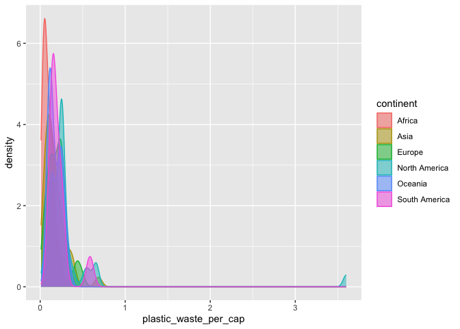
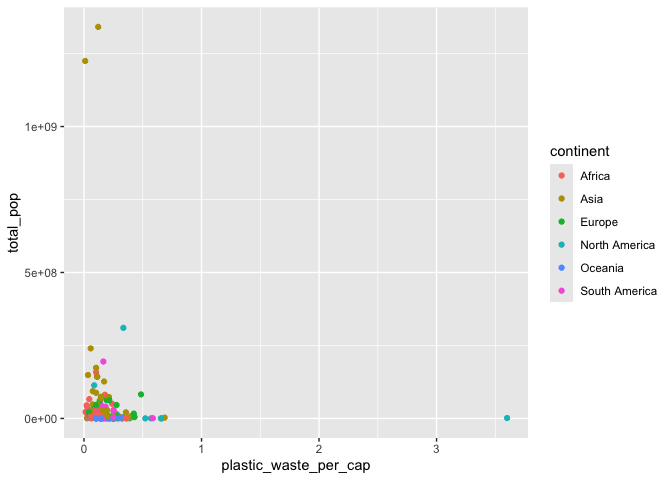

Lab 02 - Plastic waste
================
AllisonLi
01252025

## Load packages and data

``` r
library(tidyverse)
library(datasauRus) 
```

``` r
plastic_waste <- read.csv("data/plastic-waste.csv")
```

## Exercises

### Exercise 1.1

``` r
# the distribution of plastic waste per capita in 2010
ggplot(data = plastic_waste, aes(x = plastic_waste_per_cap, color = continent, fill = continent)) +
  geom_histogram(binwidth = 0.2)+
  facet_wrap(~ continent)
```

    ## Warning: Removed 51 rows containing non-finite outside the scale range
    ## (`stat_bin()`).

<!-- -->

``` r
# identify the outlier country: 
plastic_waste %>%
  filter(plastic_waste_per_cap > 3.5)
```

    ##   code              entity     continent year gdp_per_cap plastic_waste_per_cap
    ## 1  TTO Trinidad and Tobago North America 2010    31260.91                   3.6
    ##   mismanaged_plastic_waste_per_cap mismanaged_plastic_waste coastal_pop
    ## 1                             0.19                    94066     1358433
    ##   total_pop
    ## 1   1341465

In general, three out of the six continents show less than .5 plastic
waste per capital. Asia and North America, as well as an outlier in
South America show more relatively more plastic waste per capital.
Additionally, there is an outlier in North American, indicating that
Trinidad and Tobago has more than 3.5 pastic waste per capital. The
internet suggests that is probably due to single-use plastic bottles and
small population size.

### Exercise 2.1

``` r
# density plot
ggplot(
  data = plastic_waste,
  mapping = aes(
    x = plastic_waste_per_cap,
    color = continent,
    fill = continent
  )
) +
  geom_density(alpha = 0.5)
```

    ## Warning: Removed 51 rows containing non-finite outside the scale range
    ## (`stat_density()`).

<!-- -->

### Exercise 2.2

Alpha is known as transparency, it makes the variable either less or
more transparable. Color and fill are usually a way to assign a color or
a certain aesthetic to a variable. For alpha, it is a setting
characteristic that is assigned as a constant value for the whole layer.
All the variables presented will be set to the same alpha value. In
other words, Alpha does not present the differences in data.

``` r
# side-by-side box plots
ggplot(
  data = plastic_waste,
  mapping = aes(
    x = continent,
    y = plastic_waste_per_cap
  )
) +
  geom_boxplot()
```

    ## Warning: Removed 51 rows containing non-finite outside the scale range
    ## (`stat_boxplot()`).

<!-- -->

### Exercise 3.1

``` r
# Violin plots
ggplot(
  data = plastic_waste,
  mapping = aes(
    x = continent,
    y = plastic_waste_per_cap,
    color = continent,
    fill = continent
  )
) +
  geom_violin()
```

    ## Warning: Removed 51 rows containing non-finite outside the scale range
    ## (`stat_ydensity()`).

<!-- -->

Box plot clearly shows the median value for each continent and each
outlier, while the violin plot shows the density, indicating how many
countries there are for each level of plastic waste per capital in each
continent. For example, the violin plot allows us to see most countries
in Africa has close to 0 plastic waste per capital. The median value and
outlier are apparent in the box plot.

### Exercise 4.1

``` r
# scatter plots
ggplot(
  data = plastic_waste,
  mapping = aes(
    x = mismanaged_plastic_waste_per_cap,
    y = plastic_waste_per_cap
  )
) +
  geom_point()
```

    ## Warning: Removed 51 rows containing missing values or values outside the scale range
    ## (`geom_point()`).

<!-- -->

It seems to be that most dots (countries) appeared to be around the low
value. Although the relationship does not look like a linear
relationship, it could be considered as a slightly positive linear
relationship. This suggested that as the amount of mismanaged plastic
waste per capital increases, the plastic waste per capital also
increases.

### Exercise 4.2

``` r
# colored scatter plots
ggplot(
  data = plastic_waste,
  mapping = aes(
    x = mismanaged_plastic_waste_per_cap,
    y = plastic_waste_per_cap,
    color = continent,
    fill = continent
  )
) +
  geom_point()
```

    ## Warning: Removed 51 rows containing missing values or values outside the scale range
    ## (`geom_point()`).

<!-- -->

Based on the graph, it seems like there isn’t a clear distinction for
each continente in terms of the relationship between the plastic waste
per capital and mismanaged plastic waste per capital.

### Exercise 4.2

``` r
# plastic waste per capital and total population
ggplot(
  data = plastic_waste,
  mapping = aes(
    x = plastic_waste_per_cap,
    y = total_pop,
    color = continent,
    fill = continent
  )
) +
  geom_point()
```

    ## Warning: Removed 61 rows containing missing values or values outside the scale range
    ## (`geom_point()`).

<!-- -->

``` r
# plastic waste per capital and coastal population
ggplot(
  data = plastic_waste,
  mapping = aes(
    x = plastic_waste_per_cap,
    y = coastal_pop,
    color = continent,
    fill = continent
  )
) +
  geom_point()
```

    ## Warning: Removed 51 rows containing missing values or values outside the scale range
    ## (`geom_point()`).

<!-- -->

None of both seems to have a strong linear relationship. However, the
relationship between plastic waste per capital and coastal population
seems to be more strongly linearly associated.

``` r
# insert code here
```

### Exercise 5

Remove this text, and add your answer for Exercise 5 here.

``` r
# insert code here
```
